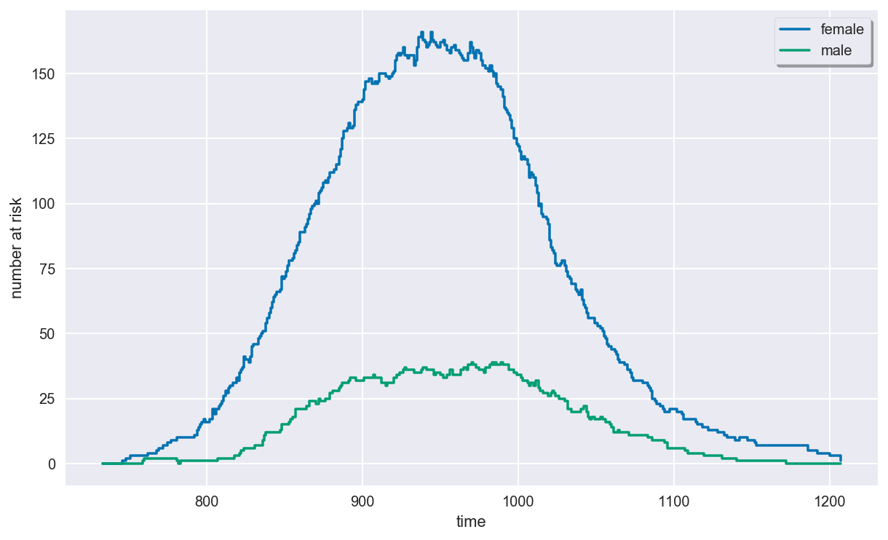
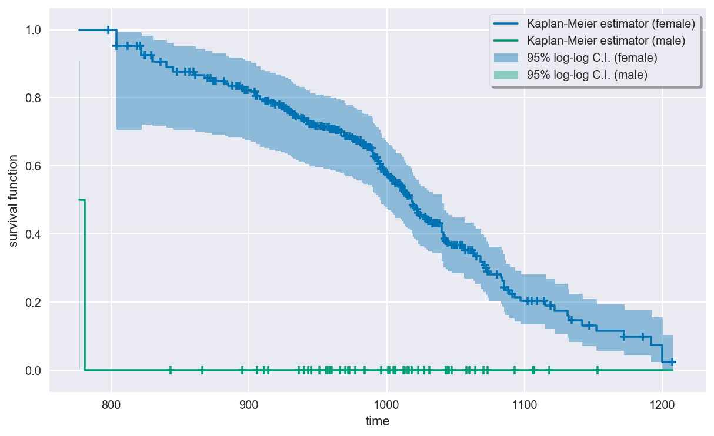
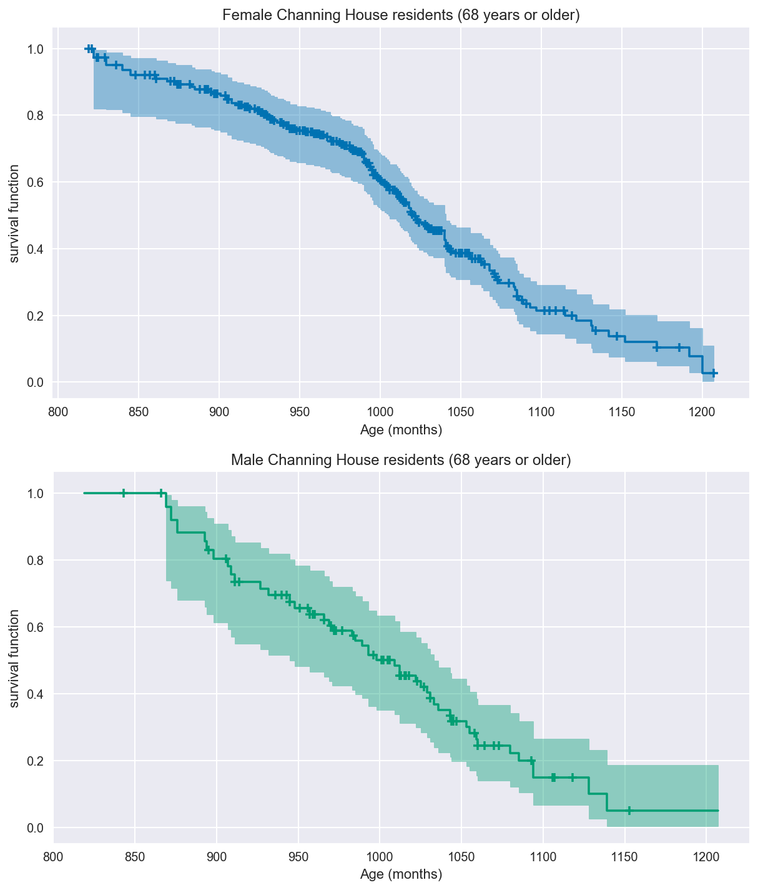
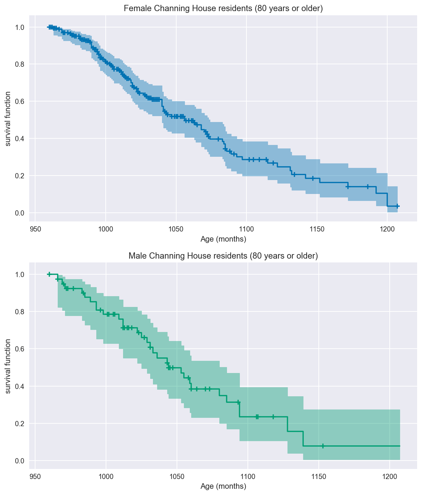

Channing House Data
===================

This is the ``channing`` dataset in the R package
`boot <https://cran.r-project.org/web/packages/boot/index.html>`__. From
the package description:

    Channing House is a retirement centre in Palo Alto, California.
    These data were collected between the opening of the house in 1964
    until July 1, 1975. In that time 97 men and 365 women passed through
    the centre. For each of these, their age on entry and also on
    leaving or death was recorded. A large number of the observations
    were censored mainly due to the resident being alive on July 1, 1975
    when the data was collected. Over the time of the study 130 women
    and 46 men died at Channing House. Differences between the survival
    of the sexes, taking age into account, was one of the primary
    concerns of this study."

These data feature *left truncation* because residents entered Channing
House at different ages, and their lifetimes were not observed before
entry. This is a biased sampling problem since there are no observations
on individuals who died before potentially entering Channing House.

.. code:: ipython3

    import matplotlib.pyplot as plt
    import seaborn as sns
    sns.set(style="darkgrid", palette="colorblind", color_codes=True)
    
    from survive import datasets
    from survive import SurvivalData
    from survive.nonparametric import KaplanMeier

Loading the Dataset
-------------------

The ``channing()`` function in the ``survive.datasets`` module loads a
``pandas.DataFrame`` containing the Channing House data. The columns of
this ``DataFrame`` are \* ``sex`` - Sex of each resident (male or
female). \* ``entry`` - The resident's age (in months) on entry to the
centre. \* ``exit`` - The age (in months) of the resident on death,
leaving the centre or July 1, 1975 whichever event occurred first. \*
``time`` - The length of time (in months) that the resident spent at
Channing House (this is ``exit - entry``). \* ``status`` -
Right-censoring indicator. 1 indicates that the resident died at
Channing House, 0 indicates that they left the house prior to July 1,
1975 or that they were still alive and living in the centre at that
date.

.. code:: ipython3

    channing = datasets.channing()
    channing.head()

.. raw:: html

    

    
    <table border="1" class="dataframe">
      <thead>
        <tr style="text-align: right;">
          <th></th>
          <th>sex</th>
          <th>entry</th>
          <th>exit</th>
          <th>time</th>
          <th>status</th>
        </tr>
        <tr>
          <th>resident</th>
          <th></th>
          <th></th>
          <th></th>
          <th></th>
          <th></th>
        </tr>
      </thead>
      <tbody>
        <tr>
          <th>0</th>
          <td>male</td>
          <td>782</td>
          <td>909</td>
          <td>127</td>
          <td>1</td>
        </tr>
        <tr>
          <th>1</th>
          <td>male</td>
          <td>1020</td>
          <td>1128</td>
          <td>108</td>
          <td>1</td>
        </tr>
        <tr>
          <th>2</th>
          <td>male</td>
          <td>856</td>
          <td>969</td>
          <td>113</td>
          <td>1</td>
        </tr>
        <tr>
          <th>3</th>
          <td>male</td>
          <td>915</td>
          <td>957</td>
          <td>42</td>
          <td>1</td>
        </tr>
        <tr>
          <th>4</th>
          <td>male</td>
          <td>863</td>
          <td>983</td>
          <td>120</td>
          <td>1</td>
        </tr>
      </tbody>
    </table>
    

Exploratory Data Analysis
-------------------------

We use the Channing House data to create a ``SurvivalData`` object.

.. code:: ipython3

    surv = SurvivalData(time="exit", entry="entry", status="status", group="sex",
                        df=channing)
    print(surv)

.. parsed-literal::

    female
    
     798+  804   804+  812+  819+  821+  822   824+  825+  829+  830   836+
     840   845   848+  848+  854+  857+  860+  861   861+  868   870+  870+
     872+  873   874+  875+  876+  882+  883   885   888+  891+  891+  892+
     893+  895   895+  897   897+  898+  899+  901   904+  905   905   905+
     905+  905+  906+  908   908   911   912+  912+  912+  913+  914+  915 
     916+  917+  918+  919   919+  922+  923   924+  925+  926   926+  926+
     926+  927+  927+  927+  928   928+  929+  930   930+  931   932   932+
     932+  932+  933+  934   934+  936   938+  938+  938+  939+  939+  940 
     940+  941   942+  943+  944   944   944+  944+  945+  946+  947+  948 
     948+  948+  950+  950+  952+  952+  953+  953+  954   954+  955+  955+
     955+  957+  957+  958+  958+  959   959+  959+  960+  961+  961+  962+
     963   963+  964+  965+  965+  966   967+  969   969   970   970+  971+
     971+  973+  973+  975   975+  975+  976   976+  976+  976+  977+  977+
     978   978+  979+  979+  979+  981+  982   982   982+  983   983+  984+
     985+  985+  985+  985+  986   986+  987+  988+  988+  989   989+  989+
     990   990   990   990   991   991+  992   992+  992+  993+  993+  994 
     994   994+  994+  995   995   995+  996   996   996   996+  996+  997+
     998   998+  999  1000  1000+ 1001  1001+ 1001+ 1003  1003+ 1004  1004+
    1005  1005+ 1005+ 1006  1006  1006+ 1006+ 1006+ 1008+ 1008+ 1009+ 1010 
    1010+ 1010+ 1010+ 1011  1011+ 1011+ 1012  1012  1012+ 1012+ 1012+ 1013 
    1013+ 1014  1014+ 1014+ 1014+ 1015  1015+ 1015+ 1016+ 1017  1018  1018 
    1019  1019  1019+ 1019+ 1019+ 1019+ 1020  1020+ 1020+ 1021  1022+ 1023 
    1023  1023+ 1023+ 1024  1024+ 1027  1028+ 1029  1029+ 1030  1030+ 1031+
    1031+ 1032+ 1033  1033+ 1034+ 1035+ 1036+ 1036+ 1037+ 1038+ 1040  1040 
    1040  1040  1041  1041  1041  1042+ 1042+ 1043  1043+ 1044  1044+ 1047 
    1047+ 1049+ 1050+ 1051+ 1053+ 1054+ 1054+ 1055+ 1056  1056  1057+ 1059+
    1061+ 1062+ 1063  1063+ 1064  1065+ 1068  1068  1070  1071+ 1071+ 1072 
    1072+ 1073  1073+ 1074  1080+ 1083  1084  1085  1085  1085+ 1086  1088+
    1089  1091+ 1093  1097  1102+ 1105+ 1105+ 1109+ 1114+ 1115  1119+ 1122 
    1131  1132  1134+ 1142  1147+ 1152  1172  1172+ 1186+ 1192  1200  1200 
    1207+
    
    male
    
     777   781   843+  866+  869   872   876   893   894   895+  898   906+
     907   909   911   911+  914+  927   932   936+  940+  943+  943+  945 
     945+  948   951+  956+  957   957+  959+  960+  966   966+  969   970+
     971   972+  973+  977+  983   984+  985   989   993   993   996+  998 
    1001+ 1002+ 1005+ 1006+ 1009  1012  1012  1012+ 1013+ 1015+ 1016+ 1018+
    1022  1023+ 1025  1027+ 1029  1031  1031+ 1031+ 1033  1036  1043  1043+
    1044  1044+ 1045+ 1047+ 1053  1055  1058+ 1059  1060  1060+ 1064+ 1070+
    1073+ 1080  1085  1093+ 1094  1094  1106+ 1107+ 1118+ 1128  1139  1153+

.. parsed-literal::

    /Library/Frameworks/Python.framework/Versions/3.7/lib/python3.7/site-packages/survive-0.0.0-py3.7.egg/survive/survival_data.py:174: UserWarning: Ignoring 5 observations where entry >= time.
      f"Ignoring {np.sum(~mask)} observations where entry >= time.")

The warning here is due to the fact that five of the observations in the
data have entry times that are the same or later than the corresponding
final times. These observations consequently cannot be used.

.. code:: ipython3

    # The five observations responsible for the warning above
    display(channing.loc[channing.exit <= channing.entry])

.. raw:: html

    

    
    <table border="1" class="dataframe">
      <thead>
        <tr style="text-align: right;">
          <th></th>
          <th>sex</th>
          <th>entry</th>
          <th>exit</th>
          <th>time</th>
          <th>status</th>
        </tr>
        <tr>
          <th>resident</th>
          <th></th>
          <th></th>
          <th></th>
          <th></th>
          <th></th>
        </tr>
      </thead>
      <tbody>
        <tr>
          <th>56</th>
          <td>male</td>
          <td>953</td>
          <td>953</td>
          <td>0</td>
          <td>0</td>
        </tr>
        <tr>
          <th>351</th>
          <td>female</td>
          <td>957</td>
          <td>957</td>
          <td>0</td>
          <td>0</td>
        </tr>
        <tr>
          <th>372</th>
          <td>female</td>
          <td>944</td>
          <td>944</td>
          <td>0</td>
          <td>0</td>
        </tr>
        <tr>
          <th>373</th>
          <td>female</td>
          <td>935</td>
          <td>935</td>
          <td>0</td>
          <td>0</td>
        </tr>
        <tr>
          <th>433</th>
          <td>female</td>
          <td>959</td>
          <td>912</td>
          <td>53</td>
          <td>1</td>
        </tr>
      </tbody>
    </table>
    

The last line above doesn't even make sense since the entry time (959)
is greater than the exit time (912). The resident's duration is 53,
which suggests that the entry time is likely supposed to be 859 (after
all, 859+53=912). Nevertheless, we will ignore this observation.

.. code:: ipython3

    display(surv.describe)

.. raw:: html

    

    
    <table border="1" class="dataframe">
      <thead>
        <tr style="text-align: right;">
          <th></th>
          <th>total</th>
          <th>events</th>
          <th>censored</th>
        </tr>
        <tr>
          <th>group</th>
          <th></th>
          <th></th>
          <th></th>
        </tr>
      </thead>
      <tbody>
        <tr>
          <th>female</th>
          <td>361</td>
          <td>129</td>
          <td>232</td>
        </tr>
        <tr>
          <th>male</th>
          <td>96</td>
          <td>46</td>
          <td>50</td>
        </tr>
      </tbody>
    </table>
    

Plotting the At-Risk Process
~~~~~~~~~~~~~~~~~~~~~~~~~~~~

Due to the left-truncation, the risk set size initially increases as
residents enter Channing House and then decreases as residents die or
are censored.

.. code:: ipython3

    plt.figure(figsize=(10, 6))
    surv.plot_at_risk()
    plt.show()
    plt.close()

Estimating the survival function
--------------------------------

The out-of-the-box Kaplan-Meier estimator does a poor job estimating the
survival function for the Channing House data because risk set of the
male residents is zero very early on before growing. This causes the
survival function estimate to be zero for most of the observed times,
which is clearly wrong. We will show the problem graphically in this
case and then discuss how to fix it.

.. code:: ipython3

    km = KaplanMeier().fit(surv)
    
    plt.figure(figsize=(10, 6))
    km.plot()
    plt.show()
    plt.close()

One way to address this issue is to condition on survival up to a later
time, say 68 or 80 years (816 or 960 months).

.. code:: ipython3

    km68 = KaplanMeier()
    km68.fit(time="exit", entry="entry", status="status", group="sex", df=channing,
             min_time=816, warn=False)

.. parsed-literal::

    KaplanMeier(conf_level=0.95, conf_type='log-log', n_boot=500,
                random_state=None, tie_break='discrete', var_type='greenwood')

.. code:: ipython3

    _, ax = plt.subplots(nrows=2, ncols=1, figsize=(10, 12))
    
    km68.plot("female", color="b", ax=ax[0])
    ax[0].set(title="Female Channing House residents (68 years or older)")
    ax[0].set(xlabel="Age (months)")
    
    km68.plot("male", color="g", ax=ax[1])
    ax[1].set(title="Male Channing House residents (68 years or older)")
    ax[1].set(xlabel="Age (months)")
    
    plt.show()
    plt.close()

.. code:: ipython3

    km80 = KaplanMeier()
    km80.fit(time="exit", entry="entry", status="status", group="sex", df=channing,
             min_time=960)

.. parsed-literal::

    KaplanMeier(conf_level=0.95, conf_type='log-log', n_boot=500,
                random_state=None, tie_break='discrete', var_type='greenwood')

.. code:: ipython3

    _, ax = plt.subplots(nrows=2, ncols=1, figsize=(10, 12))
    
    km80.plot("female", color="b", ax=ax[0])
    ax[0].set(title="Female Channing House residents (80 years or older)")
    ax[0].set(xlabel="Age (months)")
    
    km80.plot("male", color="g", ax=ax[1])
    ax[1].set(title="Male Channing House residents (80 years or older)")
    ax[1].set(xlabel="Age (months)")
    
    plt.show()
    plt.close()

