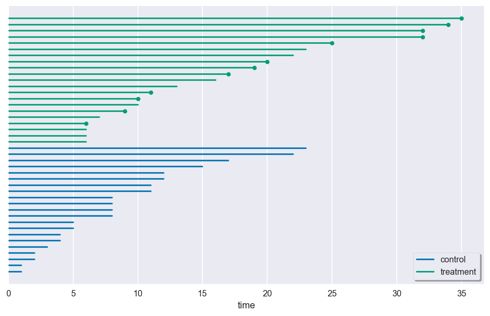
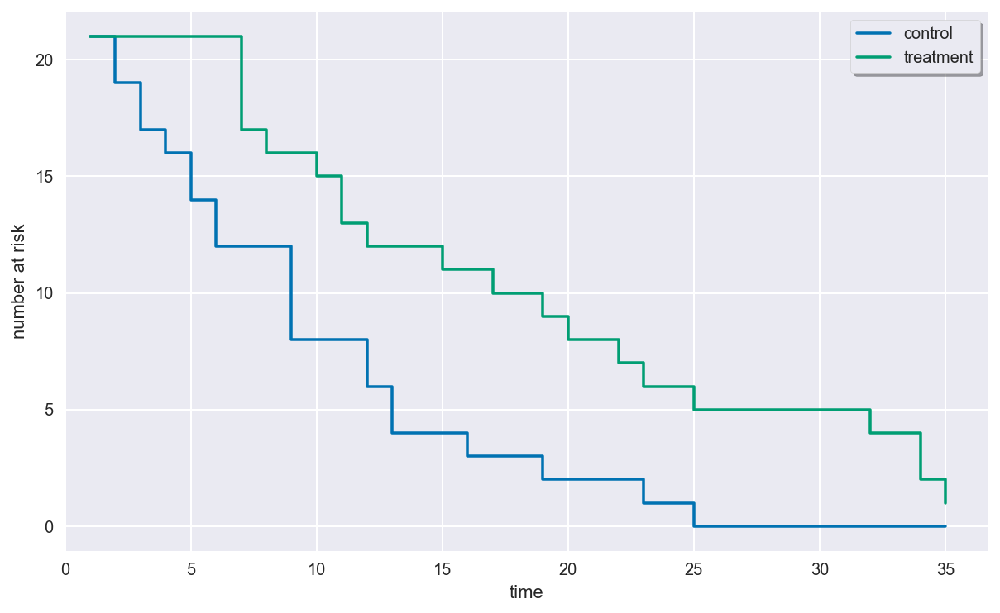
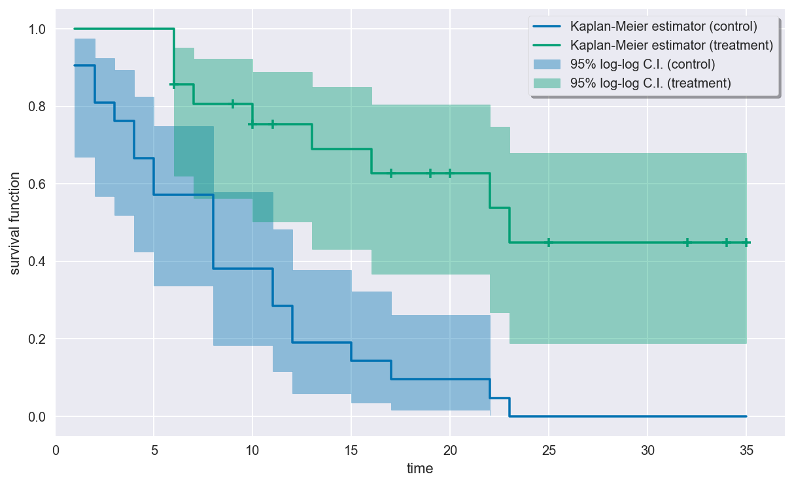

Leukemia Remission Times
========================

These data are the times of remission (in weeks) of leukemia patients.
Out of the 42 total patients, 21 were in a control group, and the other
21 were in a treatment group. Patients were observed until their
leukemia symptoms relapsed or until the study ended, whichever occurred
first. Each patient in the control group experienced relapse before the
study ended, while 12 patients in the treatment group did not come out
of remission during the study. Thus, there is heavy right-censoring in
the treatment group and no right-censoring in the control group.

One of the questions to ask about this dataset is whether the treatment
prolonged the time until relapse. Formally, we are interested in whether
there is a statistical difference between the time-to-relapse
distributions of the control and treatment groups. In this notebook we
will use the ``survive`` package to investigate this question.

.. code:: ipython3

    import matplotlib.pyplot as plt
    import seaborn as sns
    sns.set(style="darkgrid", palette="colorblind", color_codes=True)
    
    from survive import datasets
    from survive import SurvivalData
    from survive.nonparametric import KaplanMeier

Loading the dataset
-------------------

The ``leukemia()`` function in the ``survive.datasets`` module loads a
pandas DataFrame containing the leukemia data. The columns of this
DataFrame are \* ``time`` - The patients' observed leukemia remission
times (in weeks). \* ``status`` - Event/censoring indicator: 1 indicates
that the patient's leukemia relapsed, and 0 indicates that the study
ended before relapse. \* ``group`` - Indicates whether a patient is from
the control or treatment group.

.. code:: ipython3

    leukemia = datasets.leukemia()
    display(leukemia.head())

.. raw:: html

    

    
    <table border="1" class="dataframe">
      <thead>
        <tr style="text-align: right;">
          <th></th>
          <th>time</th>
          <th>status</th>
          <th>group</th>
        </tr>
        <tr>
          <th>patient</th>
          <th></th>
          <th></th>
          <th></th>
        </tr>
      </thead>
      <tbody>
        <tr>
          <th>0</th>
          <td>1</td>
          <td>1</td>
          <td>control</td>
        </tr>
        <tr>
          <th>1</th>
          <td>1</td>
          <td>1</td>
          <td>control</td>
        </tr>
        <tr>
          <th>2</th>
          <td>2</td>
          <td>1</td>
          <td>control</td>
        </tr>
        <tr>
          <th>3</th>
          <td>2</td>
          <td>1</td>
          <td>control</td>
        </tr>
        <tr>
          <th>4</th>
          <td>3</td>
          <td>1</td>
          <td>control</td>
        </tr>
      </tbody>
    </table>
    

Exploratory data analysis with ``SurvivalData``
-----------------------------------------------

The ``SurvivalData`` class in ``survive.base`` is a fundamental class
for storing and dealing with survival/lifetime data. It is aware of
groups within the data and allows quick access to various important
quantities (like the number of events or the number of individuals at
risk at a certain time).

If your survival data is stored in a pandas DataFrame (like the leukemia
data is), then a ``SurvivalData`` object can be created by specifying
the DataFrame and the names of the columns corresponding to the observed
times, censoring indicators, and group labels.

.. code:: ipython3

    surv = SurvivalData(time="time", status="status", group="group", df=leukemia)

Alternatively, you may specify one-dimensional arrays of observed times,
censoring indicators, and group labels directly. This is so that your
can use ``SurvivalData`` even if your data aren't stored in a DataFrame.

.. code:: ipython3

    # Equivalent to the constructor call above
    surv = SurvivalData(time=leukemia.time, status=leukemia.status,
                        group=leukemia.group)

Describing the data
~~~~~~~~~~~~~~~~~~~

Printing a ``SurvivalData`` object shows the observed survival times
within each group. Censored times are marked by a plus by default
(indicating that the true survival time for that individual might be
longer).

.. code:: ipython3

    print(surv)

.. parsed-literal::

    control
    
     1  1  2  2  3  4  4  5  5  8  8  8  8 11 11 12 12 15 17 22 23
    
    treatment
    
     6   6   6   6+  7   9+ 10  10+ 11+ 13  16  17+ 19+ 20+ 22  23  25+ 32+ 32+
    34+ 35+

The ``describe`` property of a ``SurvivalData`` object is a pandas
DataFrame containing simple descriptive statistics of the survival data.

.. code:: ipython3

    display(surv.describe)

.. raw:: html

    

    
    <table border="1" class="dataframe">
      <thead>
        <tr style="text-align: right;">
          <th></th>
          <th>total</th>
          <th>events</th>
          <th>censored</th>
        </tr>
        <tr>
          <th>group</th>
          <th></th>
          <th></th>
          <th></th>
        </tr>
      </thead>
      <tbody>
        <tr>
          <th>control</th>
          <td>21</td>
          <td>21</td>
          <td>0</td>
        </tr>
        <tr>
          <th>treatment</th>
          <td>21</td>
          <td>9</td>
          <td>12</td>
        </tr>
      </tbody>
    </table>
    

Visualizing the survival data
~~~~~~~~~~~~~~~~~~~~~~~~~~~~~

The ``plot_lifetimes()`` method of a ``SurvivalData`` object plots the
observed lifetimes of all the individuals in the data. Censored
individuals are marked at the end of their lifespan.

.. code:: ipython3

    plt.figure(figsize=(10, 6))
    surv.plot_lifetimes()
    plt.show()
    plt.close()

There are many longer remission times observed in the treatment group.
However, while this observation is encouraging, it is is not enough
evidence to guarantee a statistically significance treatment effect.

Computing the number of events and number of individuals at risk
~~~~~~~~~~~~~~~~~~~~~~~~~~~~~~~~~~~~~~~~~~~~~~~~~~~~~~~~~~~~~~~~

You can compute the number of events that occured at a given time within
each group using the ``n_events()`` method, which returns a pandas
DataFrame.

.. code:: ipython3

    display(surv.n_events([1, 2, 3, 4, 5, 6, 7, 8, 9, 10]))

.. raw:: html

    

    
    <table border="1" class="dataframe">
      <thead>
        <tr style="text-align: right;">
          <th>group</th>
          <th>control</th>
          <th>treatment</th>
        </tr>
        <tr>
          <th>time</th>
          <th></th>
          <th></th>
        </tr>
      </thead>
      <tbody>
        <tr>
          <th>1</th>
          <td>2</td>
          <td>0</td>
        </tr>
        <tr>
          <th>2</th>
          <td>2</td>
          <td>0</td>
        </tr>
        <tr>
          <th>3</th>
          <td>1</td>
          <td>0</td>
        </tr>
        <tr>
          <th>4</th>
          <td>2</td>
          <td>0</td>
        </tr>
        <tr>
          <th>5</th>
          <td>2</td>
          <td>0</td>
        </tr>
        <tr>
          <th>6</th>
          <td>0</td>
          <td>3</td>
        </tr>
        <tr>
          <th>7</th>
          <td>0</td>
          <td>1</td>
        </tr>
        <tr>
          <th>8</th>
          <td>4</td>
          <td>0</td>
        </tr>
        <tr>
          <th>9</th>
          <td>0</td>
          <td>0</td>
        </tr>
        <tr>
          <th>10</th>
          <td>0</td>
          <td>1</td>
        </tr>
      </tbody>
    </table>
    

In a survival study, the number of individuals "at risk" at any given
time is defined to be the number of individuals who have entered the
study by that time and have not yet experienced an event or censoring
immediately before that time. This number over time is called the
*at-risk process*.

You can compute the number of individuals at risk within each group at a
given time using the ``n_at_risk()`` method. Like ``n_events()``, this
method also returns a DataFrame.

.. code:: ipython3

    display(surv.n_at_risk([0, 5, 10, 20, 25, 30, 35]))

.. raw:: html

    

    
    <table border="1" class="dataframe">
      <thead>
        <tr style="text-align: right;">
          <th>group</th>
          <th>control</th>
          <th>treatment</th>
        </tr>
        <tr>
          <th>time</th>
          <th></th>
          <th></th>
        </tr>
      </thead>
      <tbody>
        <tr>
          <th>0</th>
          <td>0</td>
          <td>0</td>
        </tr>
        <tr>
          <th>5</th>
          <td>14</td>
          <td>21</td>
        </tr>
        <tr>
          <th>10</th>
          <td>8</td>
          <td>15</td>
        </tr>
        <tr>
          <th>20</th>
          <td>2</td>
          <td>8</td>
        </tr>
        <tr>
          <th>25</th>
          <td>0</td>
          <td>5</td>
        </tr>
        <tr>
          <th>30</th>
          <td>0</td>
          <td>4</td>
        </tr>
        <tr>
          <th>35</th>
          <td>0</td>
          <td>1</td>
        </tr>
      </tbody>
    </table>
    

Plotting the at-risk process
~~~~~~~~~~~~~~~~~~~~~~~~~~~~

You can plot the at-risk process using the ``plot_at_risk()`` method of
a ``SurvivalData`` object.

.. code:: ipython3

    plt.figure(figsize=(10, 6))
    surv.plot_at_risk()
    plt.show()
    plt.close()

Estimating the survival function with ``KaplanMeier``
-----------------------------------------------------

Kaplan-Meier estimator
~~~~~~~~~~~~~~~~~~~~~~

The *Kaplan-Meier estimator* (AKA *product limit estimator*) is a
nonparametric estimator of the survival function of the time-to-event
distribution that can be used even in the presence of right-censoring.

The ``KaplanMeier`` class in the ``survive.nonparametric`` module
implements the Kaplan-Meier estimator.

Initializing the estimator
~~~~~~~~~~~~~~~~~~~~~~~~~~

You can initialize a ``KaplanMeier`` object with no parameters.

.. code:: ipython3

    # Kaplan-Meier estimator to be used for the leukemia data
    km = KaplanMeier()

Now ``km`` is a Kaplan-Meier estimator waiting to be fitted to survival
data. We didn't pass any parameters to the initializer of the
Kaplan-Meier estimator, but we could have. Printing a ``KaplanMeier``
object shows what initializer parameter values were used for that object
(and default values for parameters that weren't specified explicitly).

.. code:: ipython3

    print(km)

.. parsed-literal::

    KaplanMeier(conf_level=0.95, conf_type='log-log', n_boot=500,
                random_state=None, tie_break='discrete', var_type='greenwood')

We'll use these default parameters.

Fitting the estimator to the leukemia data
~~~~~~~~~~~~~~~~~~~~~~~~~~~~~~~~~~~~~~~~~~

We can fit our Kaplan-Meier estimator to the leukemia data using the
``fit()`` method. There are a few ways of doing this, but the easiest is
to pass it an existing ``SurvivalData`` instance.

.. code:: ipython3

    km.fit(surv)

.. parsed-literal::

    KaplanMeier(conf_level=0.95, conf_type='log-log', n_boot=500,
                random_state=None, tie_break='discrete', var_type='greenwood')

The other ways to call ``fit()`` are described in the method's
docstring. Note that ``fit()`` fits the estimator in-place and returns
the estimator itself.

Summarizing the fit
~~~~~~~~~~~~~~~~~~~

Once the estimator is fitted, the ``summary`` property of a
``KaplanMeier`` object tabulates the survival probability estimates and
thier standard error and confidence intervals for the event times within
each group. It can be printed to display all the information at once.

.. code:: ipython3

    print(km.summary)

.. parsed-literal::

    Kaplan-Meier estimator
    
    control
    
    time  events  at risk  estimate  std. error  95% c.i. lower  95% c.i. upper
       1       2       21  0.904762    0.064056        0.670046        0.975294
       2       2       19  0.809524    0.085689        0.568905        0.923889
       3       1       17  0.761905    0.092943        0.519391        0.893257
       4       2       16  0.666667    0.102869        0.425350        0.825044
       5       2       14  0.571429    0.107990        0.337977        0.749241
       8       4       12  0.380952    0.105971        0.183067        0.577789
      11       2        8  0.285714    0.098581        0.116561        0.481820
      12       2        6  0.190476    0.085689        0.059482        0.377435
      15       1        4  0.142857    0.076360        0.035657        0.321162
      17       1        3  0.095238    0.064056        0.016259        0.261250
      22       1        2  0.047619    0.046471        0.003324        0.197045
      23       1        1  0.000000         NaN             NaN             NaN
    
    treatment
    
    time  events  at risk  estimate  std. error  95% c.i. lower  95% c.i. upper
       6       3       21  0.857143    0.076360        0.619718        0.951552
       7       1       17  0.806723    0.086935        0.563147        0.922809
      10       1       15  0.752941    0.096350        0.503200        0.889362
      13       1       12  0.690196    0.106815        0.431610        0.849066
      16       1       11  0.627451    0.114054        0.367511        0.804912
      22       1        7  0.537815    0.128234        0.267779        0.746791
      23       1        6  0.448179    0.134591        0.188052        0.680143

*Note:* The NaNs (not a number) appearing in the summary are caused by
the standard error estimates not being defined when the survival
function estimate is indentically zero. This is expected behavior.

Visualizing the fit
~~~~~~~~~~~~~~~~~~~

The estimated survival curves for the two groups can be drawn using the
``plot()`` method of the ``KaplanMeier`` object. By default, censored
times in the sample are indicated by plus signs on the curve.

.. code:: ipython3

    plt.figure(figsize=(10, 6))
    km.plot()
    plt.show()
    plt.close()

The plot seems to indicate that the patients in the treatment group are
more likely to have longer remission times than patients in the control
group.

Estimating survival probabilities
~~~~~~~~~~~~~~~~~~~~~~~~~~~~~~~~~

The ``predict()`` method of a ``KaplanMeier`` object returns a pandas
DataFrame of estimated probabiltiies for surviving past a certain time
for each group.

.. code:: ipython3

    estimate = km.predict([5, 10, 15, 20, 25])
    display(estimate)

.. raw:: html

    

    
    <table border="1" class="dataframe">
      <thead>
        <tr style="text-align: right;">
          <th>group</th>
          <th>control</th>
          <th>treatment</th>
        </tr>
        <tr>
          <th>time</th>
          <th></th>
          <th></th>
        </tr>
      </thead>
      <tbody>
        <tr>
          <th>5</th>
          <td>0.571429</td>
          <td>1.000000</td>
        </tr>
        <tr>
          <th>10</th>
          <td>0.380952</td>
          <td>0.752941</td>
        </tr>
        <tr>
          <th>15</th>
          <td>0.142857</td>
          <td>0.690196</td>
        </tr>
        <tr>
          <th>20</th>
          <td>0.095238</td>
          <td>0.627451</td>
        </tr>
        <tr>
          <th>25</th>
          <td>0.000000</td>
          <td>0.448179</td>
        </tr>
      </tbody>
    </table>
    

Estimating time-to-event distribution quantiles
~~~~~~~~~~~~~~~~~~~~~~~~~~~~~~~~~~~~~~~~~~~~~~~

The ``quantile()`` function of a ``KaplanMeier`` object returns a pandas
DataFrame of empirical quantile estimates for the time-to-relapse
distribution

.. code:: ipython3

    quantiles = km.quantile([0.25, 0.5, 0.75])
    display(quantiles)

.. raw:: html

    

    
    <table border="1" class="dataframe">
      <thead>
        <tr style="text-align: right;">
          <th>group</th>
          <th>control</th>
          <th>treatment</th>
        </tr>
        <tr>
          <th>prob</th>
          <th></th>
          <th></th>
        </tr>
      </thead>
      <tbody>
        <tr>
          <th>0.25</th>
          <td>4.0</td>
          <td>13.0</td>
        </tr>
        <tr>
          <th>0.50</th>
          <td>8.0</td>
          <td>23.0</td>
        </tr>
        <tr>
          <th>0.75</th>
          <td>12.0</td>
          <td>NaN</td>
        </tr>
      </tbody>
    </table>
    

